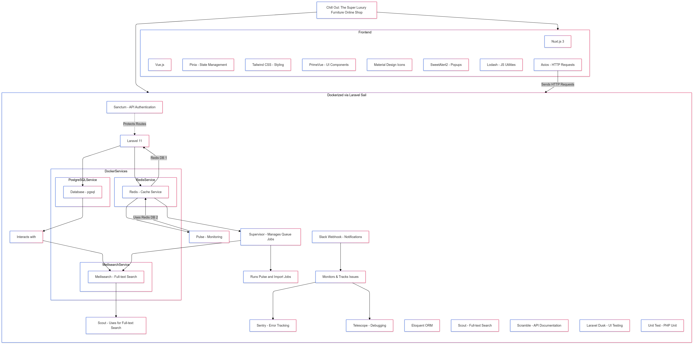

# Chill out: The Super Luxury Funiture Online Shop

## Overview

Welcome to Chill Out, your destination for premium, high-end furniture. Discover a curated selection of luxurious pieces to elevate your home's elegance and comfort.

This `main-backend-docker` branch enhances the backend by fully containerizing all services using Docker, including Redis, PostgreSQL, and Meilisearch, for a consistent and isolated development environment. The frontend remains local for seamless development.

For the original branch, visit the [main branch on GitHub](https://github.com/LeTiepTuyen/Final_Advanced_Project_ChillOut).

## Architecture & Services

The backend architecture in this branch utilizes the following containerized services:

- **Laravel Application**: The main backend application container
- **PostgreSQL**: Primary database
- **Redis**: Handles caching and Laravel Pulse data storage
- **Meilisearch**: Powers the real-time search functionality
- **Supervisor** (Optional): Manages queue workers for Meilisearch and Pulse

## Technologies

### Backend

- **Laravel**: A robust PHP framework for building scalable, secure, and high-performance web applications, offering tools for routing, database migrations, and templating.
- **Eloquent ORM**: Laravel's built-in Object-Relational Mapping (ORM) that provides an elegant and intuitive way to interact with the database, supporting relationships, query building, and model management.
- **Sanctum**: A Laravel package for managing API authentication and single-page application (SPA) tokens with simplicity and security.
- **Pulse**: A Laravel tool for monitoring application health and performance, providing insights into metrics, errors, and system statuses.
- **Scout**: A Laravel package for adding full-text search functionality to models, supporting integration with search engines like Algolia or Elasticsearch.
- **Sentry**: A real-time error tracking and monitoring tool that helps developers identify and fix issues in applications, integrated seamlessly with Laravel.
- **Scramble**: A Laravel utility for generating API documentation dynamically, helping developers create clear and structured documentation directly from their codebase.
- **Meilisearch**: A fast and modern search engine that integrates easily with Laravel through Scout, providing features like typo tolerance, relevance ranking, and instant search capabilities.
- **Telescope**: A debugging and monitoring tool for Laravel applications, providing insights into requests, jobs, exceptions, logs, and more, tailored for developers to enhance productivity.
- **Slack Webhook**: A Laravel feature for sending notifications and alerts to Slack channels, enabling real-time communication about application events, errors, or system updates.
- **Laravel Dusk**: A browser automation testing tool for simulating user interactions and performing end-to-end tests in a Laravel application.
- **Laravel Sail**:A lightweight command-line interface for interacting with Docker, providing a simple way to set up and manage a development environment for Laravel applications using Docker containers.
- **Redis**: Used as a caching service for performance improvement and data storage for Pulse.
- **Supervisor**: A process manager for running Laravel queues (e.g., Meilisearch and Pulse jobs). **_(Optional)_**
- **Octane with RoadRunner**: A high-performance application server that optimizes Laravel applications by running processes more efficiently, reducing latency, and improving throughput. **_(Optional)_**

### Frontend

- **Nuxt.js**: A framework for building server-side rendered Vue.js applications.
- **Vue.js**: The progressive JavaScript framework for building user interfaces.
- **Pinia**: A state management library for Vue.
- **Tailwind CSS**: A utility-first CSS framework for rapid UI development.
- **PrimeVue**: A rich set of UI components for Vue.
- **Material Design Icons**: A collection of free-to-use, community-driven icons.
- **SweetAlert2**: A beautiful, responsive, customizable, and accessible replacement for JavaScript's popup boxes.
- **Lodash**: A modern JavaScript utility library delivering modularity, performance, and extras.
- **Axios**: A JavaScript library for making HTTP requests, offering a simple API with support for Promises, JSON data handling, request cancellation, and easy configuration.

## Detail of the project

- [Wireframe](./WireFrame/Readme.md)
- [Planning](./Planning/README.md)
- [ERD Diagram](./Database_Description/DATABASE_DESCRIPTION.md)
- [ScreenShot](./Screenshot/README.md)
- [Video](./Video/ReviewVideo.mp4)

## Prerequisites

Before running this project, ensure you have the following installed:

- [Node.js](https://nodejs.org/en/download/)
- [Vue.js](https://vi.vuejs.org/v2/guide/installation)
- [Git](https://git-scm.com/downloads)
- [PHP](https://www.php.net/distributions/php-8.4.2.tar.gz)
- [PgAdmin 4](https://www.enterprisedb.com/downloads/postgres-postgresql-downloads)
- [Docker](https://docker.com)

## Project Flow

Here is our Project Flow Chart:



[Click here to download the Flow Chart](./Screenshot/FlowChart_Backend_Docker.png)

## Setup Instructions

### Prerequisites

Before running this project, ensure the following are installed:

[Docker Desktop](https://www.docker.com/products/docker-desktop)

- **For Windows users**:
  - Enable and install [WSL 2](https://docs.microsoft.com/en-us/windows/wsl/install)
  - Install Ubuntu distribution from Microsoft Store
  - In Docker Desktop, enable WSL 2 integration with Ubuntu under Settings -> Resources -> WSL Integration

[Laravel Sail](https://laravel.com/docs/11.x/sail#installation) (Recommended)

- Sail provides a light-weight command-line interface for Docker
- Alternative: Use standard Docker Compose commands if preferred

---

### Running Backend (Laravel with Docker)

The backend of this project has been fully Dockerized. It runs alongside several services (PostgreSQL, Redis, and Meilisearch) in Docker containers.

#### Included Files for Reference

All necessary configuration files for setting up the project can be found in the `config-templates` directory:

1.  **`.env.example`**: Sample environment variables for the backend and services.
2.  **`docker-compose.yml`**: Defines the Dockerized setup for the backend and its services.
3.  **`Dockerfile`**: Used for building the Laravel application image.
4.  **`supervisor` directory**: Contains Supervisor configuration files for managing queue jobs:
    - `laravel-worker.conf`: Manages queue jobs for Meilisearch.
    - `supervisord.conf`: Supervisor's main configuration file.

To use these files, copy and customize them as needed.

#### Redis Cache Integration

- **Redis** is included as a service for caching and will manage data for features like Pulse monitoring.

---

### Steps to Set Up the Backend

1. **Clone the repository:**

   ```bash
   # Clone repository
   git clone https://github.com/LeTiepTuyen/Final_Advanced_Project_ChillOut.git

   # Navigate to backend directory
   cd Final_Advanced_Project_ChillOut/backend

   # Switch to Docker branch
   git checkout main-backend-docker
   ```

2. **Prepare Configuration Files for Deployment:**

   The repository includes several pre-configured files for Docker deployment:

   **`.env File`**

   1. Navigate to the `/config-templates` directory:

      ```bash
      cd ./config-templates
      ```

   2. Copy .env.example to the /backend root as .env:

      ```bash
      cp .env.example ../.env
      ```

   3. Open the .env file in the /backend root and adjust the environment variables according to your local setup:
      - Database configurations
      - Redis settings
      - Meilisearch configurations
      - Other service-specific settings

   **`docker-compose.yml`**

   - Pre-configured for all required services
   - You can customize ports and configurations as needed
   - Default ports:
     - Backend API: 8000
     - Meilisearch: 7700
     - PostgreSQL: 5432
     - Redis: 6379
     - Supervisor (optional): 9002

   **`Dockerfile`**

   - A pre-configured `Dockerfile` template is included in the `/config-templates` directory.
   - If using Laravel Sail, copy this `Dockerfile` to override the default one:

     - For Windows (WSL):

       ```bash
       cp ./config-templates/Dockerfile ./vendor/laravel/sail/runtimes/8.4/Dockerfile
       ```

     - For MacOS/Linux:
       ```bash
       sudo cp ./config-templates/Dockerfile ./vendor/laravel/sail/runtimes/8.4/Dockerfile
       ```

   **`supervisor Directory`**

   - Optional configuration for managing queue processes
   - Contains two configuration files:
     - `laravel-worker.conf`: Queue worker configuration
     - `supervisord.conf`: Supervisor daemon configuration
   - Reference the [Supervisor documentation](https://laravel.com/docs/10.x/queues#supervisor-configuration) or [Supervisor Installation](https://docs.google.com/document/d/1UQclnxsvibF73458E4T7MMHZsNMOCoBTGnG_hhzv5uw/edit?usp=sharing) compiled by me for setup instructions

3. **Start Docker Services:**

   **_Using Laravel Sail (Recommended):_**

   ```bash
   # Install Laravel Sail:
   composer require laravel/sail --dev

   # Start all containers:
   ./vendor/bin/sail up -d

   # Generate the application key:
   ./vendor/bin/sail artisan key:generate

   # Run migrations and seeders
   ./vendor/bin/sail artisan migrate --seed

   # Import products to Meilisearch
   ./vendor/bin/sail artisan scout:import 'App\Models\Product'
   ```

   **_Using Docker Compose (Without Sail):_**

   ```bash
   # Start all containers:
   docker-compose up -d

   # Execute commands inside the Laravel container:
   docker exec -it laravel.test bash

   # Run the following commands inside the container:
   php artisan migrate --seed
   php artisan key:generate
   php artisan scout:import 'App\Models\Product
   ```

4. **Configure and Run Queue Workers:**

   There are two ways to manage queue workers for Meilisearch and Pulse:

   **_Option 1: Run Queue Workers in Separate Terminals:_**

   1. Start Meilisearch queue worker:

   ```bash
   ./vendor/bin/sail artisan queue:work
   ```

   2. Start Pulse queue worker:

   ```bash
   ./vendor/bin/sail artisan pulse:work
   ```

   **_Option 2: Use Supervisor (Recommended for Production):_**

   - Reference [the Laravel Supervisor documentation](https://laravel.com/docs/10.x/queues#supervisor-configuration) for detailed setup instructions.

5. **Install and Configure Octane with RoadRunner (Optional):**

   If you want to improve the performance of your application, consider configuring Laravel Octane with the RoadRunner server application for your Dockerized backend.

   - To set up and configure Octane with RoadRunner, please refer to the official [Laravel Octane Documentation](https://laravel.com/docs/10.x/octane) for detail ed instructions.

   - If you do **not** wish to use Octane, remove or comment out the `SUPERVISOR_PHP_COMMAND` line in the `docker-compose.yml` file to avoid potential conflicts. For example:

   ```yaml
   # SUPERVISOR_PHP_COMMAND: "/usr/bin/php -d variables_order=EGPCS /var/www/html/artisan octane:start --server=roadrunner --host=0.0.0.0 --rpc-port=6001 --port=80 --workers=4 --max-requests=1500"
   ```

6. **Access Backend Services:**

   Below are the URLs for accessing various backend services:

   - **Backend API**: [http://localhost:8000](http://localhost:8000)
   - **Meilisearch Dashboard**: [http://localhost:7700](http://localhost:7700)
   - **Redis**: [http://localhost:6379](http://localhost:6379)
   - **Pulse**: [http://localhost:8000/pulse](http://localhost:8000/pulse)
   - **Telescope**: [http://localhost:8000/telescope](http://localhost:8000/telescope)
   - **Scramble API Docs**: [http://localhost:8000/docs/api](http://localhost:8000/docs/api)
   - **Supervisor** (optional): [http://localhost:9002](http://localhost:9002)
   - **Redis Insight** (optional): [http://localhost:5540](http://localhost:5540)

7. **Redis Insight (Optional):**

   If you want to monitor and track Redis caching for the `/backend` application using Redis Insight, you can install Redis Insight in a Docker container. For detailed installation instructions, please refer to the [Redis Insight Documentation](https://redis.io/docs/insight/quick-start/docker/).

### Running the Frontend (Nuxt 3)

1. **Navigate to the frontend directory:**

   ```bash
   cd ./frontend
   ```

2. **Install dependencies:**

   ```bash
   npm install
   ```

3. **Start the development server:**

   ```bash
   npm run dev
   ```

   Note: Resetting the database is generally not required unless specifically needed for development purposes.

## Contributors

1. LeTiepTuyen - Tuyen Tiep Le - [Email](mailto:tuyentieple@gmail.com)
2. hongngoc2449 - Ngoc Hong Doan - [Email](mailto:hongngoc2449@gmail.com)
3. LeTuyen2002 - Tuyen Trung Le - [Email](mailto:letrungtuyen2002@gmail.com)
4. WilliamSimon13 - Tin Thieu Mai - [Email](mailto:maithieutin@gmail.com)
