# Web Performance

### 1. Home Page

The homepage showcases the main interface of the web application.
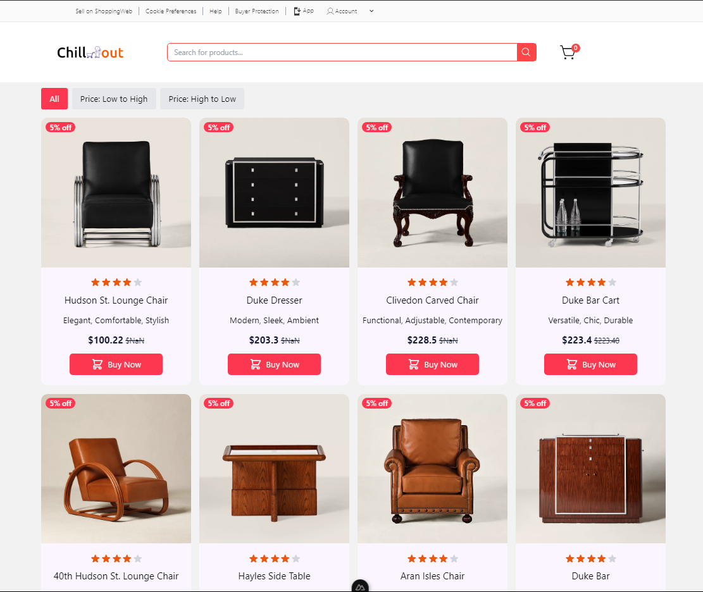

### 2. Item Page

The item page displays product details, including images, descriptions, and prices.
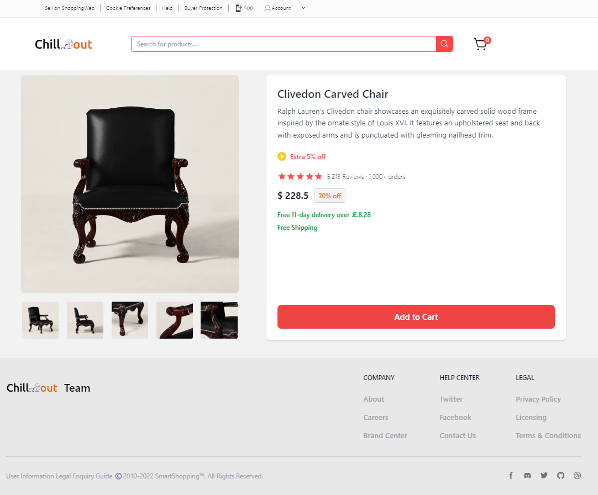

### 3. Searching Page

The searching page allows users to find products by name or category.
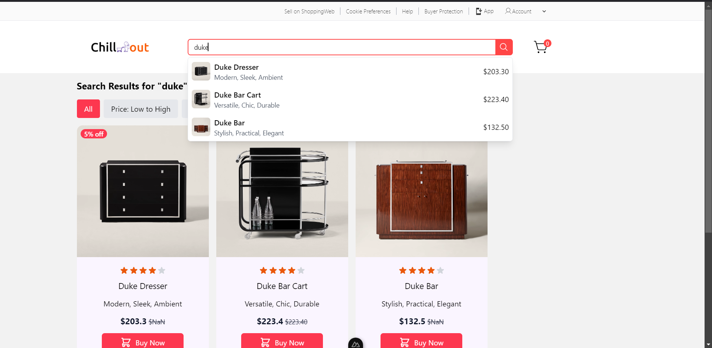

### 4. Filter Function

The filter function enables sorting products by price in ascending or descending order.

- **Low to High**
  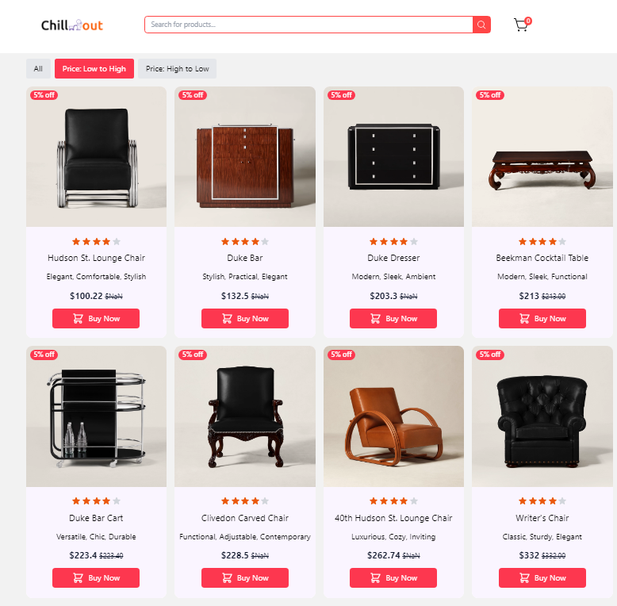
- **High to Low**
  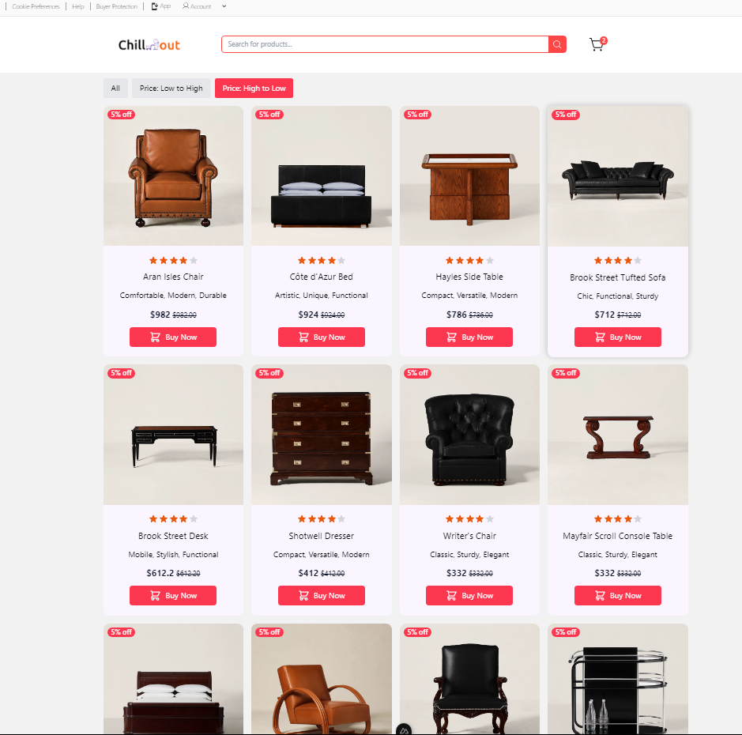

### 5. Shopping Cart

The shopping cart page shows selected items, allowing users to adjust quantities or proceed to checkout.
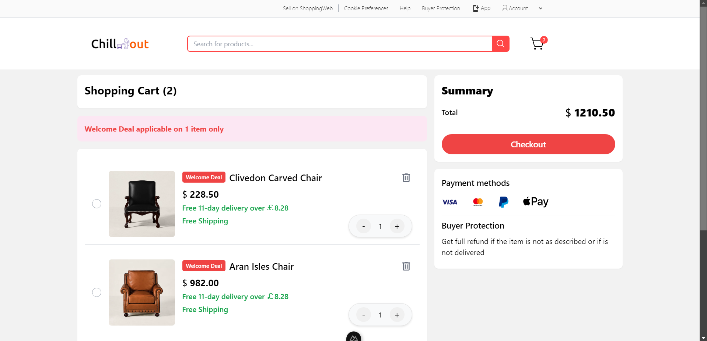

### 6. Login Page

The login page provides a secure interface for users to authenticate.
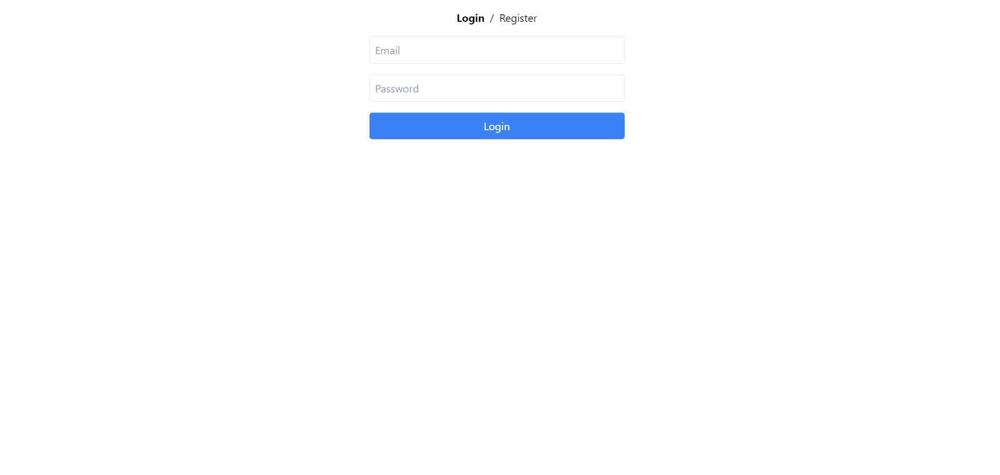

### 7. Register Page

The register page allows new users to create an account.
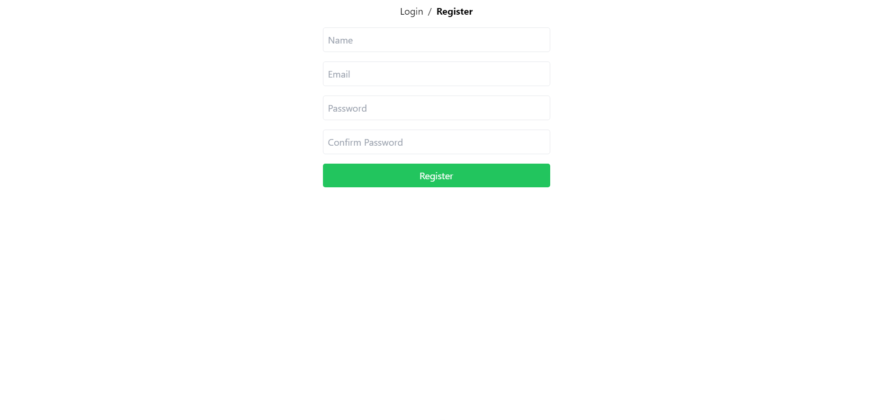

---

# System Monitoring and Debugging

### 8. Redis Insight in Docker

Monitor Redis caching in real-time using Redis Insight.
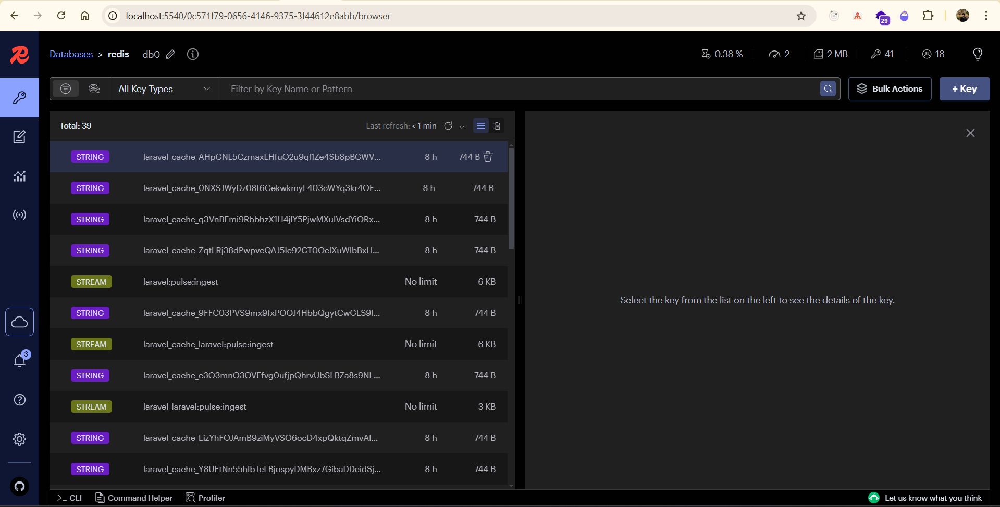

### 9. Pulse Monitoring

Pulse tracks the health and performance of the application.
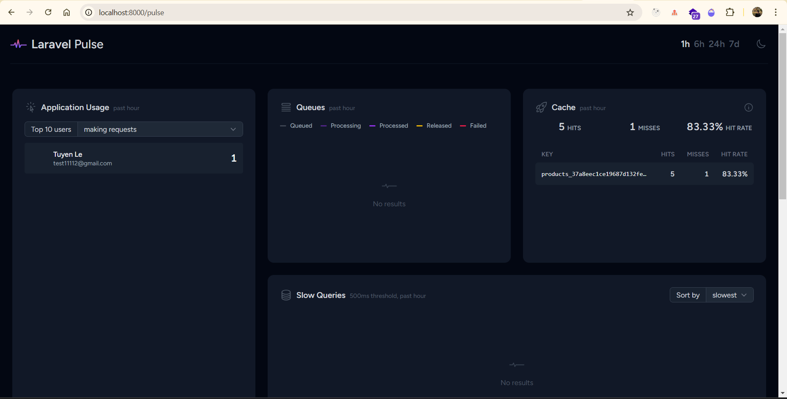

### 10. Scramble API Documentation

Scramble dynamically generates API documentation for developers.
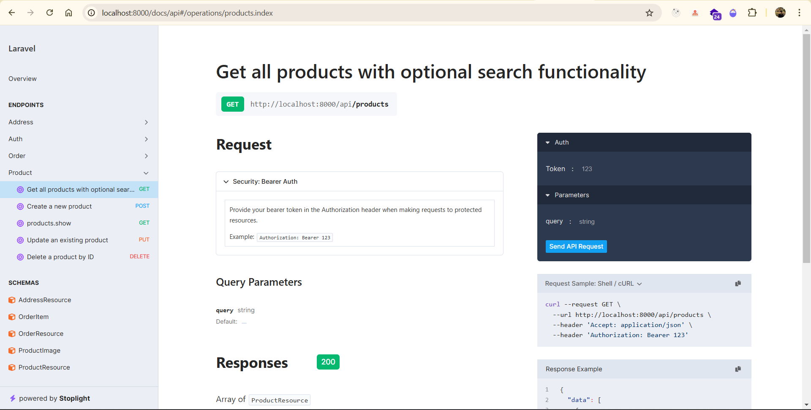

### 11. Telescope Monitoring

Telescope provides detailed logs and monitoring for Laravel.

- **General Telescope Monitoring**
  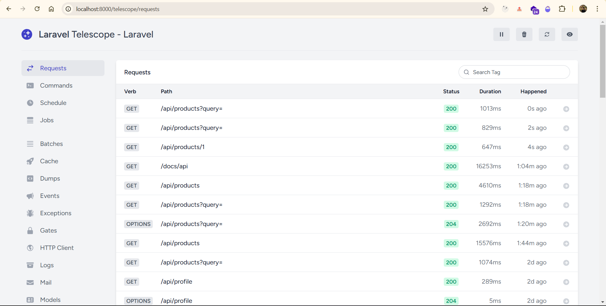
- **Redis Monitoring with Telescope**
  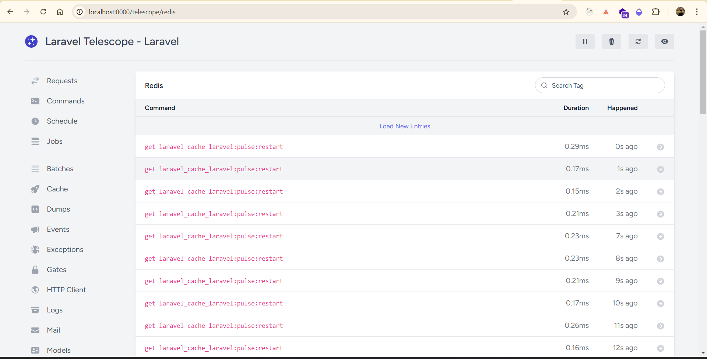
- **Cache Monitoring with Telescope**
  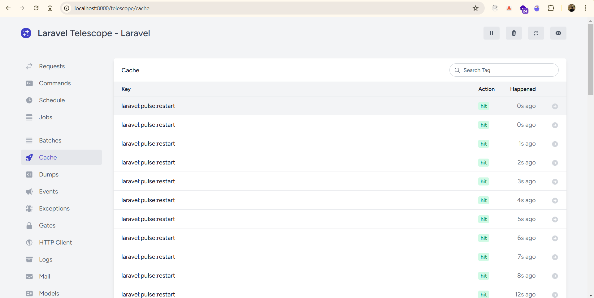

---

# Dusk Test

### Automated Browser Testing with Laravel Dusk

- **Dusk Test Overview**
  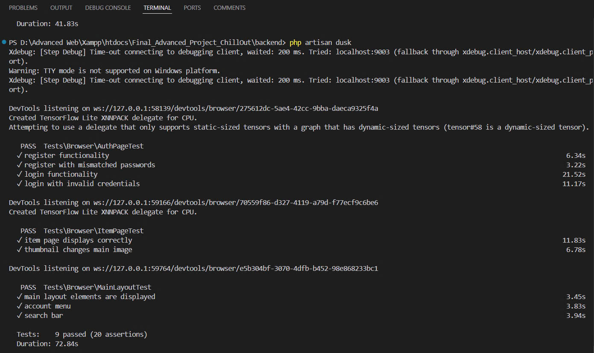
- **Test Coverage Results**
  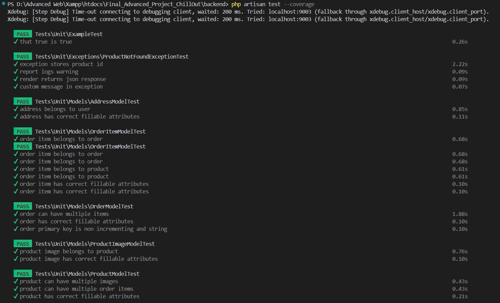
  .jpg>)
  .jpg>)

---

This README provides a visual overview of the application's key functionalities, monitoring tools, and test automation results.
